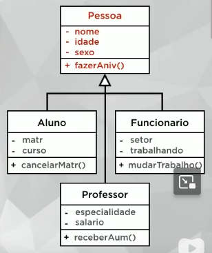

# Relacionamento entre as classes

*Caminho das Pedras*

* heranaça (is-a)
* composição (has-a) forte
* agregação (has-a) fraca
* assosiação (uses-a)

herança

tipos de herança:
* herança de implementação ou herança pobre
* herança para diferença
